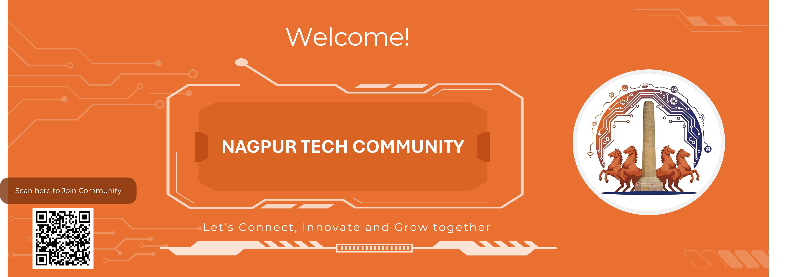

<h4 align="center">Community represents a vibrant ecosystem of technology enthusiasts, professionals, and innovators dedicated to fostering technological growth and knowledge sharing</h4>

  

## Let's Connect!

<h2>About Nagpur Tech Community </h2>

The Nagpur Tech Community represents a vibrant ecosystem of technology enthusiasts, professionals, and innovators dedicated to fostering technological growth and knowledge sharing in Nagpur and the broader region. Our community serves as a catalyst for digital transformation, bringing together individuals from diverse technical backgrounds to collaborate, learn, and build the future of technology in our city.

🔭 We are **driving force for community**.

👯 We are looking to collaborate on **technology sessions, disccussions with technology enthusiasts, Working Professionals, Speakers, Volunteers**.

<h2>Our Mission and Vision</h2>
The Nagpur Tech Community exists to bridge the gap between technological innovation and practical implementation, creating an inclusive environment where both seasoned professionals and emerging talent can thrive. Our mission centers on democratizing access to cutting-edge technology knowledge while building sustainable pathways for professional growth and community development. We envision Nagpur as a recognized technology hub where local expertise meets global standards, contributing meaningfully to India's digital economy. Our community operates on the fundamental belief that technology should be accessible, collaborative, and purpose-driven. We strive to create an ecosystem where knowledge flows freely between industry veterans and newcomers, where innovative ideas find the support they need to flourish, and where every member can contribute to the collective advancement of our technological landscape.

<h2>Community Offerings and Activities</h2>

- 📈 Learning and Development
- 🫂 Networking and Collaboration

